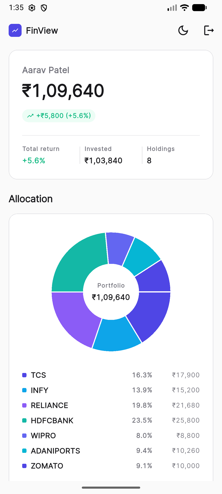
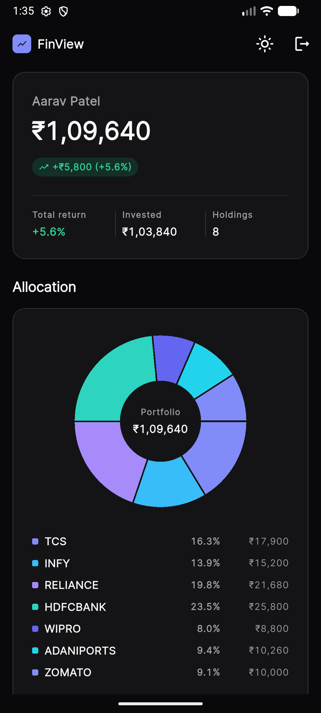

# FinView Lite

A Flutter investment dashboard app that visualizes portfolio holdings,
asset allocation, and returns using mock data.

Built as part of a frontend assignment. Uses Riverpod for state management
and fl_chart for visualizations.

---

## Screenshots

<!-- Add screenshots after UI is built -->

| Dashboard (Light)                         | Dashboard (Dark)                        |
| ----------------------------------------- | --------------------------------------- |
|  |  |

---

## Features

- Portfolio summary — total value and gain/loss
- Holdings list with per-stock gain/loss (amount or %)
- Pie chart showing asset allocation by current value
- Sort holdings by value, gain, or name
- Toggle returns between ₹ amount and percentage
- Responsive layout — mobile and web
- Dark mode toggle (bonus)
- Mock login with PIN and session persistence (bonus)
- Manual portfolio refresh with simulated price updates (bonus)

---

## Tech Stack

| Layer            | Package              | Version    |
| ---------------- | -------------------- | ---------- |
| State management | flutter_riverpod     | ^3.3.2     |
| Charts           | fl_chart             | ^1.2.0     |
| Persistence      | shared_preferences   | ^2.5.3     |
| Language         | Dart 3.x (null-safe) | sdk ^3.7.0 |

---

## Setup & Running Locally

### Prerequisites

- Flutter SDK: **3.44.0**
- Dart SDK: **3.7.0 or later**
- Run `flutter doctor` and resolve any issues before proceeding

### Steps

```bash
# 1. Clone the repo
git clone https://github.com/<your-username>/finview_lite.git
cd finview_lite

# 2. Install dependencies
flutter pub get

# 3. Run on your preferred platform
flutter run                  # default connected device
flutter run -d chrome        # Flutter web
flutter run -d android       # Android emulator/device
```

### Mock Credentials (Bonus Login)

Username: aarav
PIN: 1234

---

## Demo

<!-- Add Loom / YouTube / Google Drive screen recording link here -->

[Watch demo recording](#)

---

## Rubric Coverage

| Criteria                                   | Points |
| ------------------------------------------ | ------ |
| UI/UX clarity and visual hierarchy         | 25     |
| Code organization and widget decomposition | 20     |
| Data handling and parsing                  | 20     |
| Responsiveness (mobile/web)                | 10     |
| Error and edge-case handling               | 10     |
| Code readability and comments              | 10     |
| Bonus visual/animation polish              | 5      |
